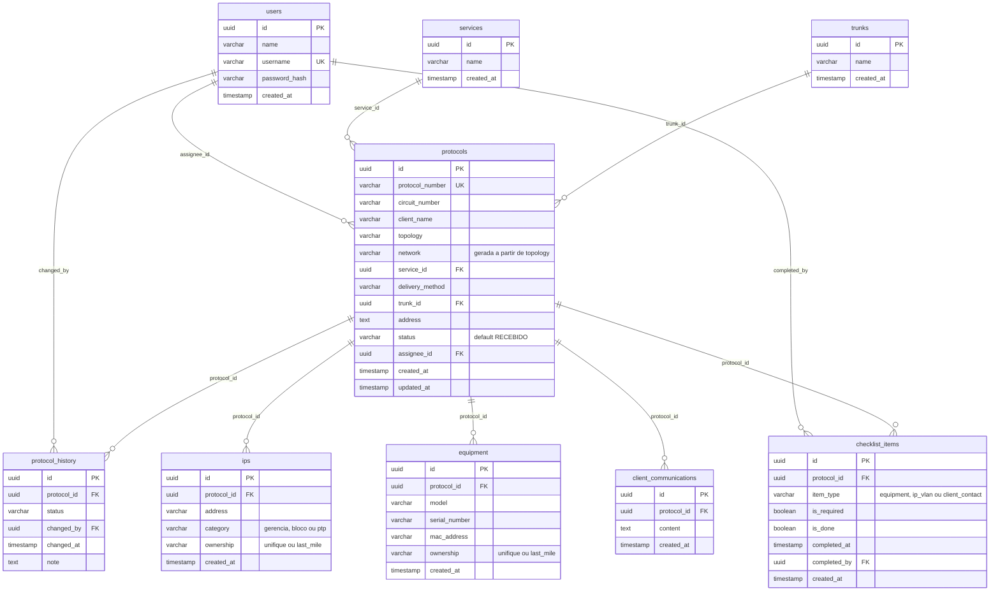

# Modelo de dados (ERD)

Schema do PostgreSQL 16, definido em `backend/src/database/migrations/`. Este documento descreve o estado resultante da aplicação das migrations 001 a 003.

## Diagrama

`protocols` é o Aggregate Root do Módulo Desk: todas as demais tabelas de negócio apontam para ela.

## Regras implementadas no banco

| Regra | Onde | Como |
|-------|------|------|
| RN08–RN09: a rede deriva da topologia | Migration 002 | `protocols.network` é *generated column* (`STORED`): `GPON` e `PTP` resultam em `unifique`; qualquer outra topologia resulta em `last_mile`. Não pode ser gravada diretamente |
| RN10: Last Mile exige método de entrega | Migrations 001 e 002 | `CHECK chk_delivery_method_last_mile`: `network <> 'last_mile' OR delivery_method IS NOT NULL` (recriada na 002, pois o `DROP COLUMN` a removeu) |
| RN06: histórico imutável | Migration 003 | Triggers `BEFORE UPDATE` e `BEFORE DELETE` em `protocol_history` lançam exceção. Defesa em profundidade: a aplicação também só faz `INSERT` |
| `updated_at` automático | Migration 001 | Trigger `trg_protocols_updated_at` |
| Valores de `ownership`, `category` e `item_type` | Migration 001 | `CHECK` com lista fechada de valores |

## Observações

- **Status** não é uma tabela nem um `ENUM` do banco: é `VARCHAR(50)` e a validação dos 12 estados e das transições fica na máquina de estados da aplicação (`backend/src/state-machine/protocol.state-machine.js`; veja [api-endpoints.md](api-endpoints.md)).
- **`protocol_history.changed_by`** existe no schema, mas hoje a aplicação não o preenche. O `PATCH /protocols/:id` grava só `protocol_id`, `status` e `note` (texto `Transição: A → B`). O histórico, portanto, ainda não registra quem fez a mudança.
- **`client_communications` e `checklist_items`** existem no schema, mas ainda não têm model nem endpoint. A regra de checklist completo ao sair da fase técnica está pendente.
- **`ips` e `equipment`** também ainda não têm model nem endpoint; a persistência e o `ownership` foram validados diretamente via SQL (ver [devops-log.md](devops-log.md), 09/09/2026).
- **Dados iniciais:** a migration 001 insere cinco serviços em `services`: Banda Larga, Dedicado, Interconexão, BGP e Wifi Business.
- A tabela `users` não tem migration de seed. Usuários são criados fora do fluxo de migrations: `backend/scripts/gerar-hash.js <senha>` imprime o hash bcrypt, e o `INSERT` em `users` é feito manualmente.
